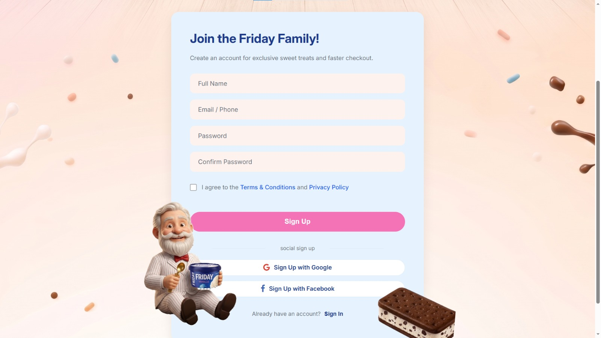
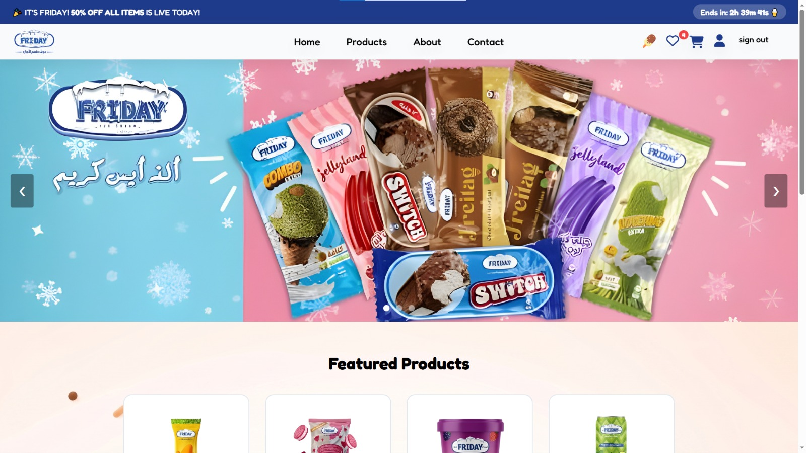
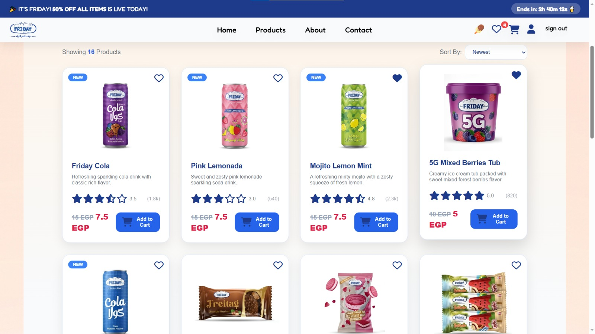
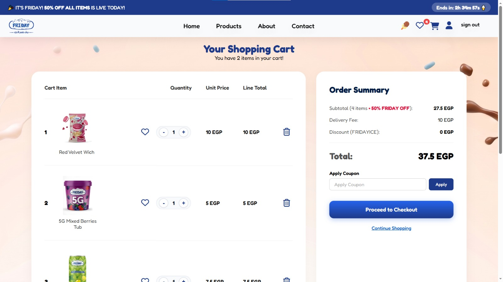
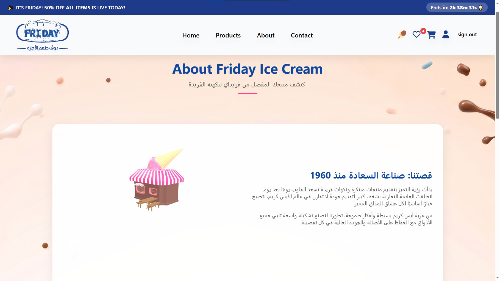

# 🍦 Friday Ice Cream Website (Frontend Concept)

Welcome to our frontend concept reimagining the website for **Friday**, the beloved Egyptian ice cream brand! We wanted to build a modern, fun, and highly interactive user experience completely from scratch. Every page is crafted to look clean, feel responsive, and bring a bit of that Friday happiness to the browser.

---

## ✨ What We Built (Core Features)

* **☀️ Live Light & Dark Modes:** Fully integrated theme toggling that changes the vibe of the entire site instantly. It uses custom CSS variables to swap palettes seamlessly across every single page.
* **🔒 Brand-Centric Sign-In:** A polished, secure-feeling login page designed specifically around Friday's iconic corporate identity and colors.
* **🛒 Interactive Shopping Cart:** A smooth cart workflow that updates items in real-time, handling product amounts, calculating subtotals, and rendering your final receipt dynamically.
* **🍦 Dynamic Product Catalog:** A responsive grid where users can filter through flavors, sort by categories (or other properties) and toggle items on or off a persistent client-side wishlist.
* **🚚 The 3D Music Truck (Our Favorite Part!):** Over on the About Page, we built a fully custom 3D Ice Cream Van that rotates smoothly and plays classic ice cream truck music when clicked—coded completely using **Vanilla CSS and Javascript** (no heavy 3D frameworks needed!).

---

## 🛠️ The Tech Stack
We deliberately chose to stick to the fundamentals to keep the site incredibly lightweight, snappy, and deeply optimized:

* **HTML5:** Semantic, well-structured layouts built with accessibility and clean document flow in mind.
* **CSS3:** Custom styles powered by modern Flexbox and Grid layout architectures, sleek transition animations, and a centralized root layout system for global theme switching.
* **Vanilla JavaScript (ES6+):** Pure script logic handling all modern UI states—from managing real-time cart calculations and array-based wishlist toggles to orchestrating the 3D rotating truck.

---

## 📸 Interface Preview

### 1. Sign In Page

### 2. Home Page - Hero & Offers Slider

### 3. Products Catalog Page

### 4. Interactive Shopping Cart

### 5. About Page - Introduction & Brand Story

### 6. About Page - Our Core Values & Timeline Journey

---

## 👥 The Team Behind the Ice Cream

This project was built with a lot of coding hours (and probably a few actual ice cream breaks) by:
* **Eyad Ibrahim**
* **Ahmed Ali**
* **Rawda Mohamed**
* **Basel Ahmed**
* **Seif Islam**
